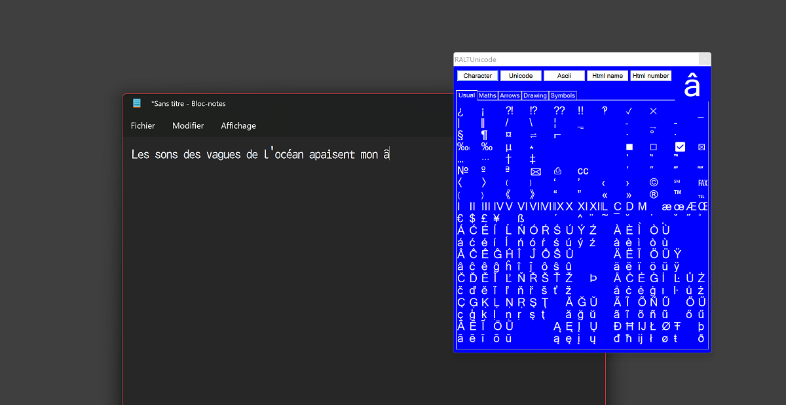

# RALTUnicode

 

This is an old project that I'm uploading to include in another one.
  

This program, made with an AutoHotkey script, allows you to quickly access your own lists of unicode characters and insert them using the mouse without losing focus on the original window.
Launching the window is carried out using a long-press key, which also serves as a tab switch when the menu is open, but does not lose its usefulness the rest of the time (unless you want to).
  

You can choose between 5 modes which remain the same for the whole session.
  
Example:
- Character (default): €
- Unicode: 20ac
- Ascii: 8364
- Html name: &euro;
- Html number: &#8364;
 

Some characters don't have an HTML name, so the number will be used instead:
- Character: ≠
- Unicode: 2260
- Ascii: 8800
- Html name: &#8800;
- Html number: &#8800;
 

RALTUnicode comes with an example, but it's a DIY system, don't hesitate to share your version
  

## How to use:

Install AutoHotkey
- Home: Custom Installation
- Version: Unicode 32-bit or 64-bit
  - Recommanded 32-bit if you want a portable compiled version to run on any system
- Location: As you want, or leave as is
- Options: Install script compiler
  - Recommand Separate taskbar buttons (each script has his own Icon on taskbar)
- Install, Exit
  

Modify RALTUnicode.ahk as you wish with any text editor (possibly install NotepadFont to see all characters correctly, with monospace font, light or full)
- Add your symbols under Symbols
  - 20 lines of 21 characters per page
  - 5 pages but if you know ahk you can add or remove some (recommended few to quickly go around)
  - Empty lines can be removed
  - Empty characters can be blank instead of space
  - Empty end of line, can be removed comma included, except ending "
- Choose your key and put it where you find «Your own key there» instead of RAlt
  - Refer to https://www.autohotkey.com/docs/KeyList.htm
  - For example AppsKey for Menu (which invoke right click context menu)
- Choose the time for long press in ms at «Long press time there» instead of 400 (leave negative)
- Add stuff you want under Miscellaneous
  - Possibly un comment CTRL+SHIFT+Z for Redo
- Uncomment section Media_Play_Pause double if you wish
  - Media Play/Pause will be immediate as always
  - But if you quicly press again, Play/Pause will be send a second time, followed by Next Track
- Uncomment section No NumLock if you wish, if you have a numpad or not
  - Whatever happens, the keys of the numpad will remain the numbers and not the other functions
- Save
  

## You can launch it directly
- Hold down the button you have chosen to activate the menu that remains on top
- Your initial key therefore remains accessible by quick press
- But when activated, you can quicly press the key again to change the page
- Double tap return to the first page
  - If the list was not opened, he opens it first
- When you are done, long press again or use the mouse to exit the window
  

## If you want a portable version which can run on any Windows system
- Prefer Unicode 32-bit as AutoHotkey Installation with Install script compiler option
- Right click on script
- Choose show more options
- Choose compile script (GUI)...
- Browse for RALTUnicode.ico Custom Icon
- Click >Convert<
- Exit, Done
 

You can use RALTUnicode.exe directly, without installing AHK
  

## Related links and source
NotepadFont:  
* https://github.com/ytyra/NotepadFont

DIY-US-INTL-Keyboard:  
* https://github.com/ytyra/DIY-US-INTL-Keyboard

AutoHotkey:  
* https://github.com/AutoHotkey  
* https://https://www.autohotkey.com/

Icon:  
* http://www.keyboard-layout-editor.com/ (KLE)  
* https://kle-render.herokuapp.com/ (KLE Render)
